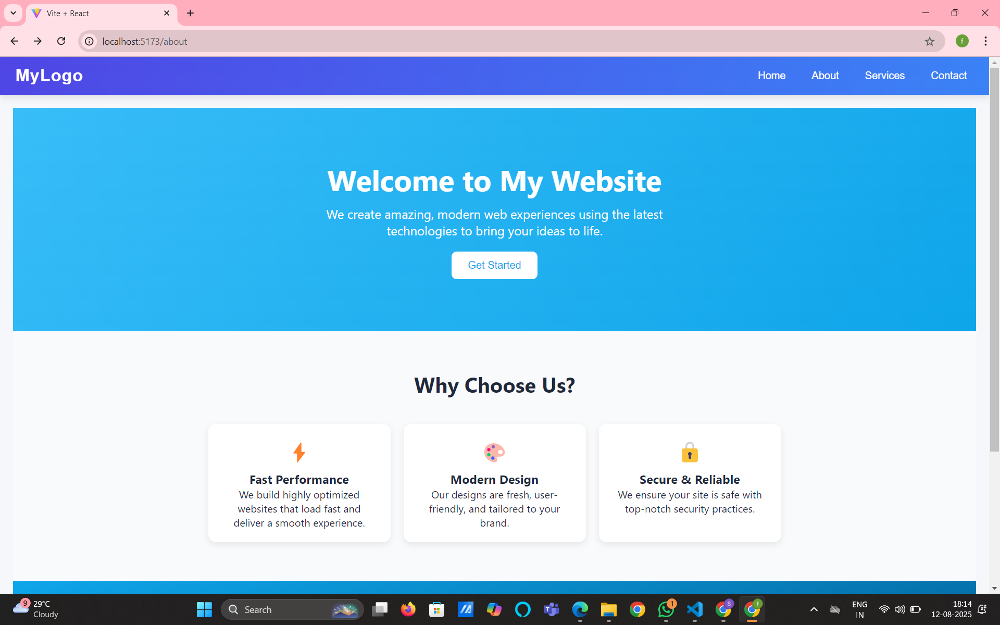

# React Navbar Navigation Without React Router

This project demonstrates how to create a simple React application with a responsive navbar and multiple pages (Home, About, Services, Contact) **without using React Router**.  
Navigation is handled using React's `useState` to switch components dynamically.

---

## 🚀 Features
- Responsive Navbar with mobile hamburger menu
- Navigation without installing `react-router-dom`
- Pages: Home, About, Services, Contact
- Custom CSS styling for a modern look

---

## 📂 Project Structure
src/
│
├── components/
│ ├── Navbar.jsx
│ ├── Home.jsx
│ ├── About.jsx
│ ├── Services.jsx
│ ├── Contact.jsx
│ └── Navbar.css
│
├── App.jsx
└── index.js

## 📸 Navbar Preview
